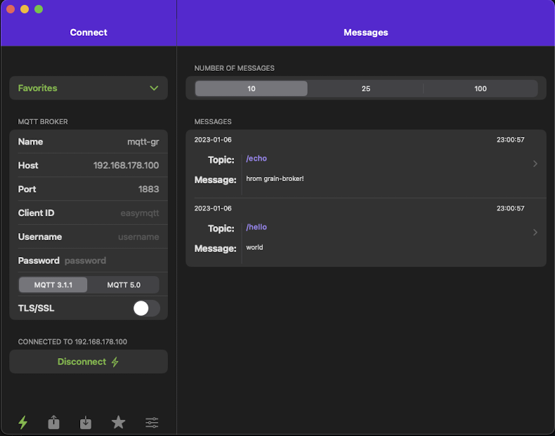
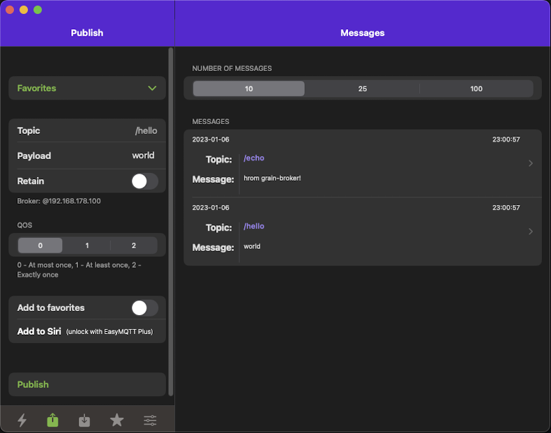
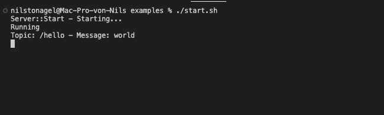

# mqtt-gr

A simple mqtt broker without any fancy stuff (no ssl and auth, ...)
  
## How to use

Run the following commands to start the server

```bash
grain compile broker.gr
wasmtime --tcplisten 192.168.178.100:1883 --env=a=b  broker.gr.wasm
```

# Screenshots

Connection


Publish


Console


# Credits

Mostly translated from: https://github.com/xDWart/MQTTbroker
